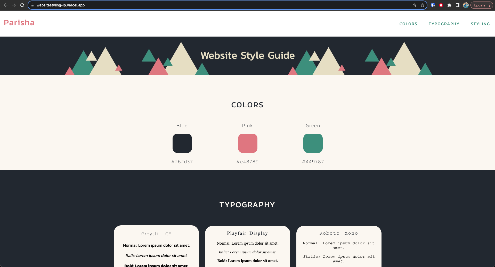

# Website Style Guide: 

Welcome to the Website Style Guide project! In this project, I have developed a comprehensive style guide and design system for a fictional website named "." A design system is a valuable tool used to organize and maintain the visual elements and components of a website, ensuring a consistent and cohesive user experience.

You can check it out on this link: [Style Guide project](https://websitestyling-lp.vercel.app/) 

## Project Overview

The Website Style Guide serves as a centralized resource to document the key design aspects of the website, including colors, typography, and specific text styles. By creating this design system, we aim to achieve the following objectives:

- Organize the Look and Feel: Present a clear and organized visual vocabulary for the website's design elements.

- Maintain Consistency: Ensure that the website's visual elements remain consistent across various pages and components.

- Enhance Collaboration: Facilitate collaboration among developers by providing a consistent reference for designing and building the website.

## Features

The Website Style Guide consists of the following sections:

- **Colors:** Explore the primary color palette of the website, including shades of blue, pink, and green. Each color is represented with its corresponding hex code.

- **Typography:** Discover the fonts used on the website, including Greycliff CF, Playfair Display, and Roboto Mono. Each font style (normal, italic, and bold) is showcased with sample text.

- **Styling:** Understand the specific styles applied to various text elements, including headings (h1, h2, h3). Detailed CSS rules for font family, font style, font size, font weight, letter spacing, word spacing, text color, and text transformations are provided.

## How to Use

1. Open the Website Style Guide in your web browser.

2. Navigate through the different sections using the navigation links in the header.

3. Explore the color palette and its corresponding hex codes in the "Colors" section.

4. Learn about the fonts used on the website and view sample text in the "Typography" section.

5. Understand the styling applied to different text elements, such as headings, in the "Styling" section.

6. Utilize the design system as a reference when designing and developing the  website.

## Installation

To view the Website Style Guide locally on your machine, follow these steps:

1. Clone or download this repository to your local machine.

2. Open the `index.html` file in your web browser.

3. Explore the different sections of the  Website Style Guide.

## Technologies Used

The Website Style Guide is built using the following technologies:

- HTML: For structuring the content and layout of the style guide.
- CSS: For styling and designing the visual appearance of the style guide.
- Google Fonts: For importing and applying custom fonts to the style guide.

## Acknowledgments

The Website Style Guide project is developed as part of a Codecademy course, showcasing the importance of design systems in maintaining consistent and cohesive website designs. The project offers an opportunity to practice organizing design elements and documenting styles.

## Credits

Special thanks to Codecademy for providing valuable resources and tutorials for web development, enabling the creation of the  Website Style Guide.

---

Experience the organized elegance of design elements and typography through the Website Style Guide. For any inquiries or feedback, feel free to reach out to us.

Explore the world of design! 🎨🖋️
